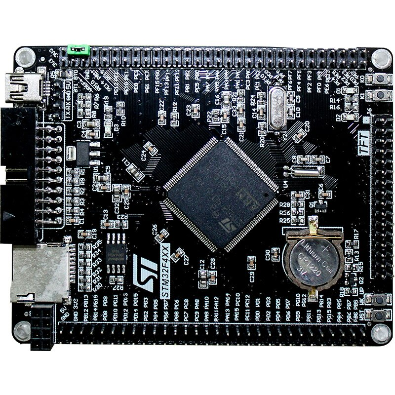
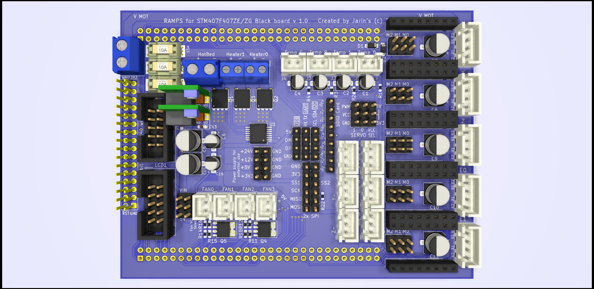
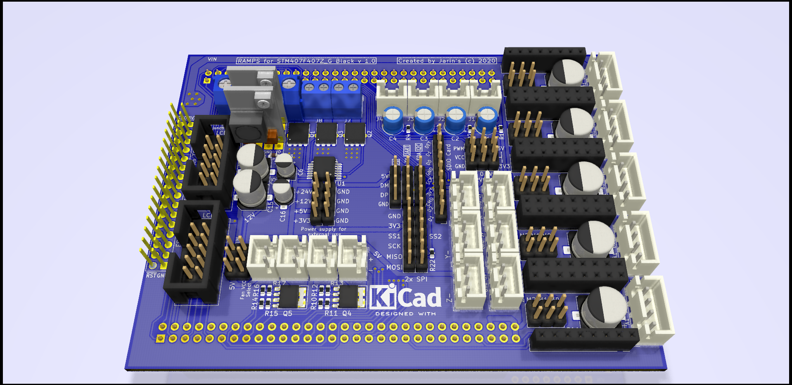
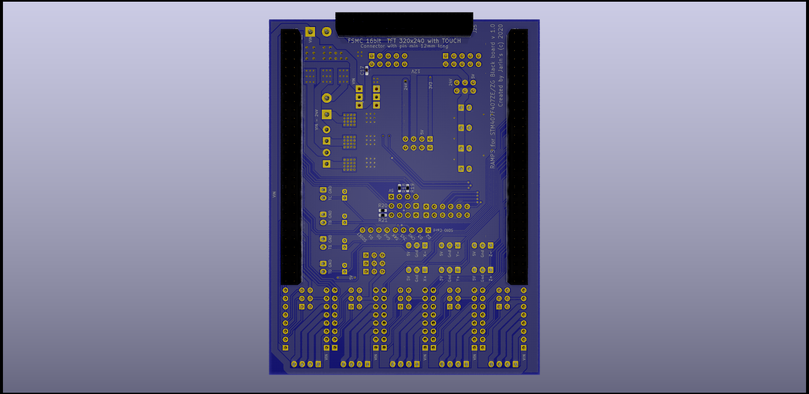

# RAMPS for STM32F407ZET6 and STM32F407ZGT6 development board Black edition from China

for example from aliexpress [e.g. here](https://www.aliexpress.com/wholesale?catId=0&initiative_id=SB_20200509043338&SearchText=stm32f407Zet6+development+board)
with pins directly compatible with original TFT display 3.2 inch 320x240 with Touch panel  [e.g. here](https://www.aliexpress.com/wholesale?catId=0&initiative_id=SB_20200509115015&origin=y&SearchText=3.2+TFT+for+STM32F407VET6)

__Work-in-progress. Caution! Not for any use yet__

The project is just starting. Other files will follow.
At this time, the exact dimensions of the CPU 
board connectors are not yet accurate

Features of the RAMPS board:
-----
  + up to 5x replaceable stepper motor drivers 
  + up to 4 thermistors or 4 thermocouples for temperature control
  + 3 power heaters (1 bed and up to 2 extruder heaters) with PWM power control up to 50A (30A without cooling, llimited by the connector used and the width of the cooper on the PCB)
  + 4 high power PWM connectors with selectable voltage for fans, LEDs or DC motors
    - 5V up to 3A in total for all outputs
    - 12V up to 3A in total for all outputs
    - VIN(24V) up to 20A each individually (limited by the connector used and the width of the cooper on the PCB)
  + 2 PWM Servos outputs
  + 6 end stops 
  + micro-sd card support with SDIO for fast file transfer
  + ports - serial, USB, I2C and 2x SPI
  + FSMC 16bit TFT port with SPI touch for [high resolution graphics display](https://www.aliexpress.com/wholesale?catId=0&initiative_id=SB_20200509115015&origin=y&SearchText=3.2+TFT+for+STM32F407VET6)  or RAMPS standard 2 flat cable LCD screen support
  + Input voltage: 12-24V
  + Super low cost ($0.85/piece) 2 DC-DC Buck reulators [Mini DC-DC 4.5-24V To 5V and 12V 3A](https://www.aliexpress.com/wholesale?catId=0&initiative_id=SB_20200509121836&origin=y&SearchText=Mini+DC-DC+12-24V+To+5V+3A+) using  MP2315 chip from MPS, which are absolutely cold during operation even at full load 3A.
  + On the STM32F407 board used 16Mbit(2MB) flash for EEPROM emulation.
  + Marlin 2.05 firmware support FSMC paralel 16 bit TFT display with Touch. 
  
  + Low cost and small board dimensions 110 x 84mm (At [JLCPCB](https://jlcpcb.com/) only $7 for 5 pieces + $7 postage = $2.8 / piece) 
  

See you

